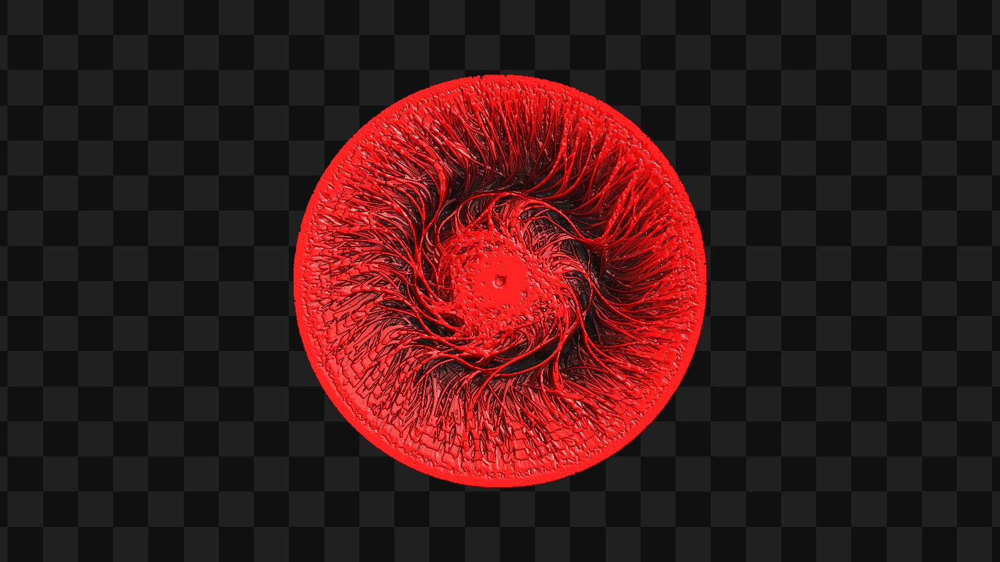
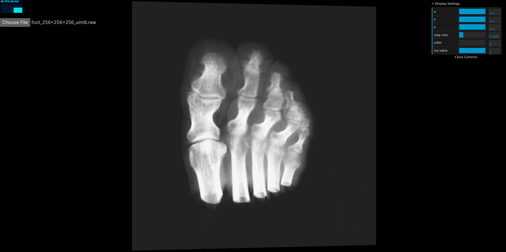
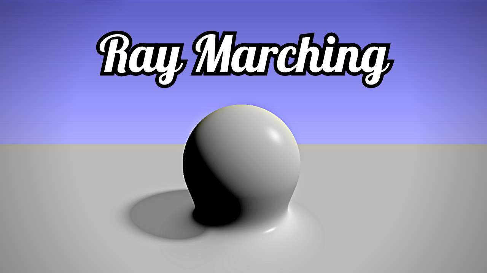
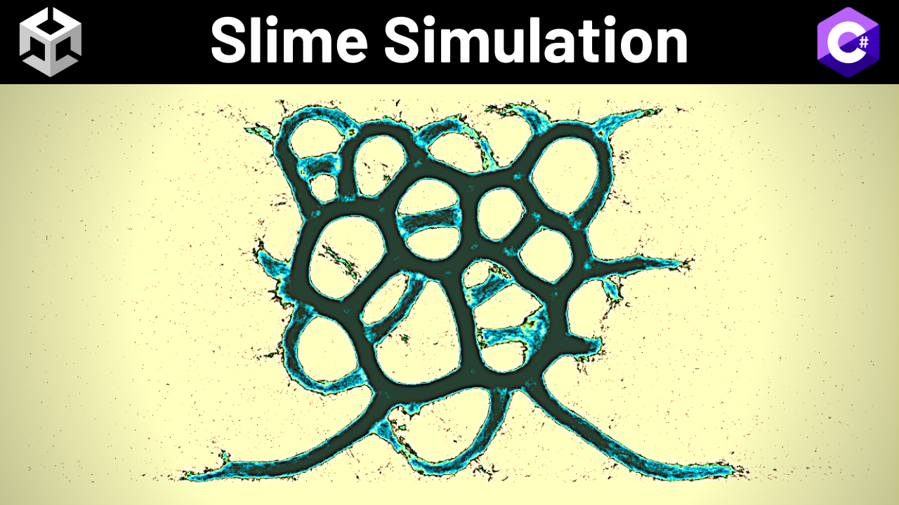
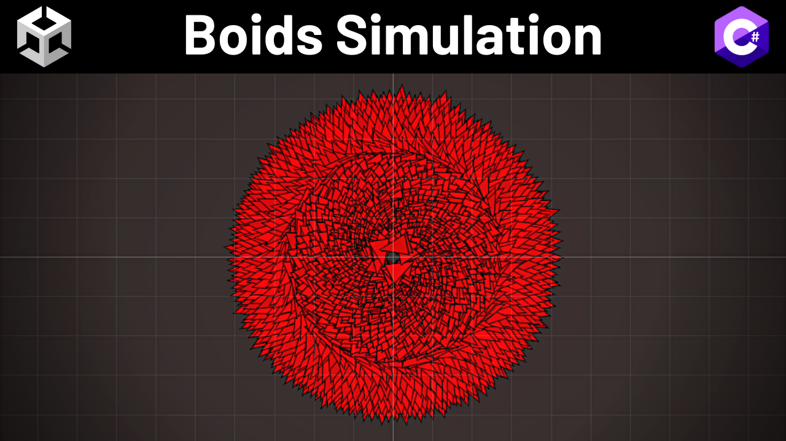

## 👋 Hi, I'm Suboptimal!

- I'm an Indian-American software engineer
- I'm passionate about computer graphics
- I post devlogs and demos on [YouTube](https://www.youtube.com/@SuboptimalEng), [Twitter](https://twitter.com/SuboptimalEng), [Threads](https://www.threads.net/@suboptimaleng), and [Instagram](https://www.instagram.com/SuboptimalEng)
- I also to watch anime, play video games, and run long distances

## 🤓 Projects

### [Slime Simulation (WebGPU)](https://github.com/SuboptimalEng/slime-sim-webgpu)

- I made this project to learn more about compute shaders in WebGPU
- Tech Stack: TypeScript, WebGPU, WGSL, Compute Shaders
- 45-Second Demo: [r/GraphicsProgramming](https://www.reddit.com/r/GraphicsProgramming/comments/1hp4kn2/webgpu_typescript_slime_mold_simulation/?utm_source=share&utm_medium=web3x&utm_name=web3xcss&utm_term=1&utm_content=share_button), [Twitter](https://x.com/SuboptimalEng/status/1873425520106582229), [Threads](https://www.threads.net/@suboptimaleng/post/DEK9UtZIX5n?xmt=AQGzdJJWLtFvVJ94Aw73-35N4bCzFWb2na419Vv8lqsOtg)
- 45-Second Demo with Music: [Instagram](https://www.instagram.com/p/DEMGo6jIiXN/), [YouTube Shorts](https://www.youtube.com/shorts/ZGJ6E04lC7Q)
- 5-Minute Devlog: [YouTube](https://www.youtube.com/watch?v=nBqZOz7AF34)
   
   
  

### [Volume Rendering](https://github.com/SuboptimalEng/volume-rendering)

- I made this project to learn how to display MRIs and CT scans in WebGL
- Tech Stack: TypeScript, WebGL, GLSL, Three.js, Ray Marching, Volume Rendering
- 30-Second Demo: [r/GraphicsProgramming](https://www.reddit.com/r/GraphicsProgramming/comments/1c9ke0p/volume_rendering_in_threejs_and_glsl/), [Twitter](https://x.com/SuboptimalEng/status/1781808470985003035)
- Learning Computer Graphics Devlog: [YouTube](https://www.youtube.com/watch?v=exkfFjhZsZ0)
   
   
  

### [Shader Tutorials](https://github.com/SuboptimalEng/shader-tutorials)

- I started a tutorial series where I learn + teach various shader techniques
- E.g. Voronoi/Perlin Noise, SDFs, Ray Marching, Fractional Brownian Motion, etc.
- Playlist with 10+ Videos: [YouTube](https://www.youtube.com/watch?v=7UvpTTEE1Hs&list=PLTJ_bWjv6i7xnDaPMrbx69zVu82sVails&pp=gAQB)
   
   
  

### [Slime Simulation (Unity)](https://github.com/SuboptimalEng/slime-sim-unity)

- I made this project to learn more about compute shaders in Unity
- It has more editor tools than the WebGPU version (e.g. gradient colorization)
- Tech Stack: Unity, C#, Shader Graph, Compute Shaders, Editor Scripting
- 60-Second YouTube Short: [Part 1](https://www.youtube.com/shorts/UN3w41sRyDo), [Part 2](https://www.youtube.com/shorts/kMzA3ftW_MQ), [Part 3](https://www.youtube.com/shorts/98FIp_uJE1k)
- 8-Minute Devlog: [YouTube](https://www.youtube.com/watch?v=BKcxJlvqNWs)
   
   
  

### [Boids (Unity)](https://github.com/SuboptimalEng/boids)

- I made this project to learn more about Unity game development
- Tech Stack: Unity, C#, Shader Graph, Compute Shaders
- 9-Minute Devlog: [YouTube](https://www.youtube.com/watch?v=HzR-9tfOJQo)
   
   
  

<!--
Note: Leaving this here incase I want to use it again.

 
 

 
 

-->
